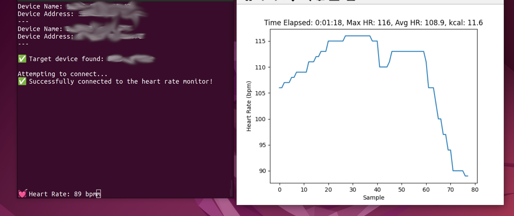
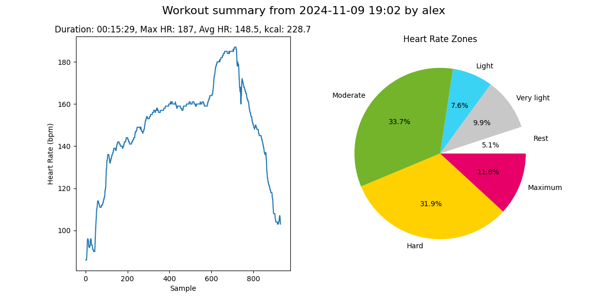

# bluetooth-heartrate-monitor
A small command-line python-based app for monitoring, logging and visualising heart rate made to run in Ubuntu. 

# Notes
I built this app only for myself while heavily relying on LLMs like ChatGPT, Copilot and Claude. I did this because I tried to find such an app but coudln't. Currently, it's only tested/developed for Ubuntu (22.04) using a *COOSPO* device. It might also work for other cases/devices but I haven't tried this out. If someone wants to extend the support, I am happy to collaborate. Over time I will add more functionality if I missing something. 

# Installation & prerequisites
In order for me to run the app, I needed to install the following python packages. 

```bash
sudo pip3 install bleak asyncio argparse matplotlib
pip3 install pandas matplotlib numpy
sudo -E pip install --upgrade typing_extensions
```

I am running this with Python 3.10.12.

# Usage
## Monitoring heart rate
Here is a screenshot of the working app:




Find out the address of the BLE by using

```bash
sudo hcitool lescan
```

then you can start the monitor by calling

```bash
sudo python3 heartrate.py -d 00:11:22:33:FF:EE # No live graph
sudo -E python3 heartrate.py -d 00:11:22:33:FF:EE --graph # With live graph
sudo -E python3 heartrate.py -d 00:11:22:33:FF:EE --graph --target 150 # With target heart rate
```

Additional arguments include:
- `-g` or `--graph` to create a live visualisation of the heart rate data
- `-t` or `--target` to set a target heart rate (bpm) for training zones and warnings
- `-n` or `--name` to specify a user profile for personalized metrics

The data will be automatically written to a timestamped .csv file in the data folder, which will be created if it doesn't exist.

Sometimes I run into issues and I have to restart the bluetooth service on Ubuntu or just try multiple times. For this I use:

```bash
sudo systemctl restart bluetooth
```

Bluetooh devices always feel very flaky to me.

## Target Heart Rate Features
When using the `--target` parameter, the application provides several training enhancements:

### Live Monitoring Features
- **Visual Target Line**: A red dashed horizontal line appears on the live graph showing your target heart rate
- **Background Color Feedback**: 
  - Pastel red background when current HR is below target
  - Pastel green background when current HR is at or above target
- **Audio Warnings**: Plays a warning sound every 5 seconds when heart rate is below target
- **Black Heart Rate Line**: The heart rate line is displayed in black for better visibility against colored backgrounds

### Example Usage
```bash
# Monitor with profile and target HR of 150 bpm
sudo -E python3 heartrate.py -d 00:11:22:33:FF:EE --graph --name alex --target 150
```

The target heart rate is automatically saved to the workout metadata and will be displayed when analyzing the workout later.

### Graceful Shutdown
The application now supports graceful shutdown to avoid errors and ensure data is properly saved:
- **Press Enter** in the terminal to stop monitoring and save all data cleanly
- **Ctrl+C** is also handled gracefully to prevent error messages
- All data is automatically saved before the program exits

## Analysing workout
A workout can be analysed using this command:

```bash
python3 analyse_workout.py -p data/heartrate_data_alex_20241109_190243.csv
```

This creates such a plot and saves it in the `workout_plots` folder. If the workout was recorded with a target heart rate, a red dashed line will automatically appear on the analysis plot showing the target zone.



## Profile Manager
The profile manager allows you to create and manage user profiles. Each profile contains personal information such as name, date of birth, weight, max. heart rate, and sex, which are used to calculate metrics like calories burned and heart rate zones.


### Creating a new profile
To create a new profile, use the following command:

```bash
python3 profile_manager.py --add --name <profile_name>
```

This will prompt you to enter the necessary information to set up the profile.

Profiles are stored as JSON files in the `configs` directory. Each profile contains the following information:
- Name
- Date of Birth
- Weight
- Max Heart Rate
- Sex

### Showing a profile
To display the details of an existing profile, use the following command:

```bash
python3 profile_manager.py --show --name <profile_name>
```

This will print the profile information and calculate the exact age based on the date of birth.

## Sound Testing
To test if the warning sound functionality works on your system, you can run:

```bash
python3 test_sound.py
```

This will play a test sound to verify that audio warnings will work during heart rate monitoring.

# Future features
- Add a way to stop monitoring that doesn't cause an error
- Add possibility to add time stamps to allow analysing sections (pressing space bar)