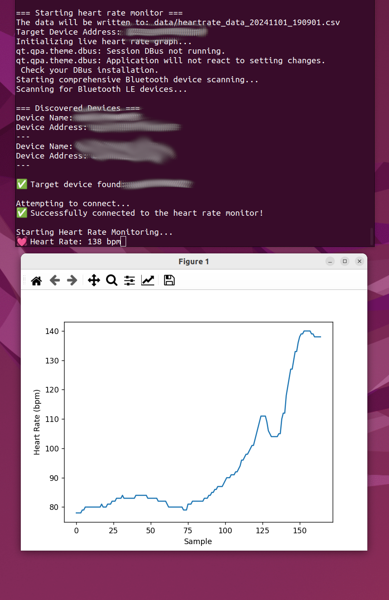

# bluetooth-heartrate-monitor
A small command-line python-based app for monitoring, logging and visualising heart rate made to run in Ubuntu. 

# Notes
I built this app only for myself while heavily relying on LLMs like ChatGPT, Copilot and Claude. I did this because I tried to find such an app but coudln't. Currently, it's only tested/developed for Ubuntu (22.04) using a *COOSPO* device. It might also work for other cases/devices but I haven't tried this out. If someone wants to extend the support, I am happy to collaborate. Over time I will add more functionality that I would like this app to have. 

# Installation & prerequisites
In order for me to run the app, I needed to install the following python packages. 

```{bash}
sudo pip3 install bleak asyncio argparse matplotlib
sudo -E pip install --upgrade typing_extensions
```

I am running this with Python 3.10.12.

# Usage

Here is a screenshot of the working app:




Find out the address of the BLE by using

```{bash}
sudo hcitool lescan
```

then you can start the monitor by calling

```{bash}
sudo python3 heartrate.py -d 00:11:22:33:FF:EE # No live graph
sudo -E python3 heartrate.py -d 00:11:22:33:FF:EE --graph # With live graph
```

Additional arguments include `-g` or `--graph` to create a live visualisation of the heart rate data. The data will be automatically written to a timestamped .csv file in the data folder, which will be created if it doesn't exist.

Sometimes I run into issues and I have to restart the bluetooth service on Ubuntu or just try multiple times. For this I use:

```{bash}
sudo systemctl restart bluetooth
```

Bluetooh devices always feel very flaky to me.

# Future features
- Add a way to stop monitoring that doesn't cause an error
- Add possibility to add time stamps to allow analysing sections (pressing space bar)
- Add additional information to the title of the graph like duration of workout, max and avg. HR
- Add config files to allow calculation of calories burned via this formula https://www.omnicalculator.com/sports/calories-burned-by-heart-rate
